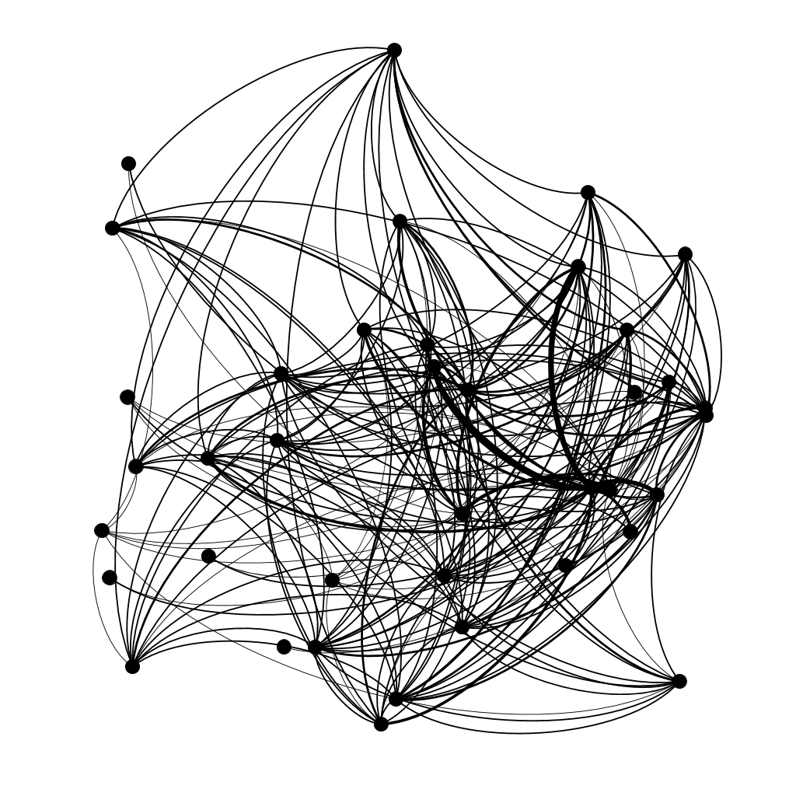

# WEB-CRAWLER 

# SOFTWARES UTILIZADO
python 3
pip
scapy
gephi

# INSTALANDO DEPENDÊNCIAS
pip install scrapy

# Rodando projeto

scrapy runspider webcrawler/spiders/Spider.py -o graph_edges.csv --nolog